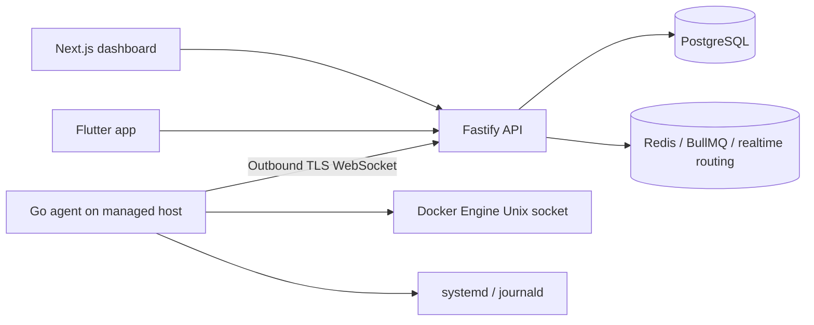

# CloudDeck

CloudDeck is a production-oriented multi-server operations and observability platform for developers, DevOps engineers, and small teams. It combines server monitoring, Docker operations, Linux service control, deployments, logs, uptime monitoring, backups, alerts, secure remote access, and workspace collaboration in one control plane.


## What is implemented

### Control plane
- Next.js web dashboard with centralized fleet, container, metrics, logs, deployment, backup, health, alert, domain, secrets, audit, member, and security surfaces.
- Fastify API with PostgreSQL, Redis, BullMQ, WebSockets, Argon2id passwords, short-lived JWTs, rotating/revocable refresh sessions, optional TOTP two-factor authentication, RBAC, audit logs, verification/reset flows, and workspace-scoped authorization.
- Personal/team workspaces with member invitations, invitation revocation/acceptance, role management, owner safeguards, and global workspace search.

### Server agent and realtime
- Go Linux agent with outbound authenticated WebSocket, one-time pairing, heartbeat telemetry, reconnect, and protected credential storage.
- CPU/RAM/disk/load/network collection with one-minute PostgreSQL aggregation and durable hourly rollups.
- Redis-backed cross-instance routing for agent commands, realtime logs, and browser terminal sessions.
- Browser terminal with explicit permission, one-time tickets, PTY lifecycle, resize/input channels, audit records, and a bounded session lifetime.

### Fleet and observability
- Centralized `/servers` fleet inventory with online/offline/pending status, current pressure, last-seen state, server creation, and one-time pairing-token display.
- Workspace-wide `/containers` Docker inventory with server attribution, search/filtering, compose context, and authorized lifecycle actions.
- Workspace-wide `/metrics` explorer with 1h/6h/24h/7d/30d ranges, fleet trends, per-server pressure, CPU/memory/disk/load/network aggregation, and 15-second refresh.
- Centralized `/logs` explorer for systemd and Docker sources, bounded snapshots, loaded-line filtering, and audited log reads.

### Docker and Linux operations
- Docker container inventory, inspect, stats, bounded logs, start/stop/restart/pause/unpause/remove actions, and Compose project/service management through typed agent commands.
- systemd service inventory plus audited start/stop/restart actions. Unit names are strictly validated and CloudDeck exposes no unrestricted shell-command endpoint.
- Realtime Docker/systemd log subscriptions using one-time WebSocket tickets and bounded in-memory UI buffers.

### Deployments
- GitHub App installation linking with installation-scoped repository/branch discovery.
- Application source configuration for Dockerfile and Compose deployments.
- BullMQ deployment queue and worker with per-application execution leases, cancellation, guarded state transitions, persisted progress/logs, and activation metadata.
- Agent-side clone/build/deploy/readiness execution with bounded typed inputs.

### Availability, domains, secrets, and backups
- Health checks, alert lifecycle, and email/in-app notification pipeline.
- Domain inventory and TLS certificate monitoring with expiry alerts and SSRF-safe public probing.
- Optional least-privilege Caddy/Nginx proxy automation through a separate root helper.
- Encrypted workspace secret storage using AES-256-GCM, metadata/value separation, audited rotation/deletion, and no plaintext list/read API.
- Verified backups for allowlisted directories, Docker volumes, PostgreSQL, and MySQL to local or S3-compatible targets, with SHA-256 manifests, post-write verification, retention cleanup, recurring schedules, encrypted credentials, and confirmed restore workflows.

### Mobile
- Flutter app foundation with rotating refresh-token sessions and secure device storage.
- Dashboard/server monitoring, historical metrics, alerts, notifications, deployment status, Docker inventory, bounded logs, and confirmed container restart for authorized operators.
- Android and iOS CI packaging.

## Architecture



CloudDeck deliberately separates the control plane from privileged host operations. Non-terminal host actions are explicitly typed, validated, authorized, and audited. There is no generic arbitrary-command API.

## Local development

Requires Node 22, npm 11, PostgreSQL 17, Redis, and Go 1.23.

```bash
cp .env.example .env
npm ci
npm run migrate
npm run dev
npm run dev:web
```

Generate a local development master key once with `openssl rand -base64 32` and place it in `CLOUDDECK_MASTER_KEY`. Production deployments should inject it through the platform secret manager rather than committing it.

Before opening a PR run:

```bash
npm run lint
npm run typecheck
npm test
npm run build
cd services/agent && go test ./... && go build ./...
```

## Pair an agent

Create a server in the dashboard and use its server ID and one-time pairing token:

```bash
cd services/agent
go build -o clouddeck-agent .
read -rs CLOUDDECK_PAIRING_TOKEN
sudo env CLOUDDECK_API_URL=https://api.example.com CLOUDDECK_SERVER_ID=<server-uuid> CLOUDDECK_PAIRING_TOKEN="$CLOUDDECK_PAIRING_TOKEN" CLOUDDECK_AGENT_BIN="$PWD/clouddeck-agent" ./install.sh
unset CLOUDDECK_PAIRING_TOKEN
```

The installer pairs once, saves the long-lived credential in a `0600` file, and starts a dedicated systemd service. Docker access is opt-in via `CLOUDDECK_DOCKER_SOCKET=/var/run/docker.sock`; Docker group membership is effectively root-equivalent. systemd service control should receive only the specific sudo/polkit permissions required by the deployment. Do not grant unrestricted passwordless sudo.

### Optional proxy helper

Managed Caddy/Nginx configuration is intentionally separate from the unprivileged Agent. Build and install the helper only on servers where CloudDeck should manage reverse-proxy fragments:

```bash
cd services/agent
go build -o clouddeck-proxy-helper ./proxyhelper
sudo env CLOUDDECK_PROXY_HELPER_BIN="$PWD/clouddeck-proxy-helper" ./install-proxy-helper.sh
```

For Caddy, add this import once to the server's main `/etc/caddy/Caddyfile`:

```caddy
import /etc/caddy/clouddeck.d/*
```

The helper refuses Caddy changes unless that import exists. Nginx apply verifies the generated `conf.d` file is present in `nginx -T` before reload.

## Documentation

- [Feature status](docs/FEATURE_STATUS.md)
- [Architecture](docs/ARCHITECTURE.md)
- [Agent protocol](docs/AGENT_PROTOCOL.md)
- [Security](docs/SECURITY.md)
- [Deployment](docs/DEPLOYMENT.md)

## Current roadmap

The main product surfaces and operational workflows are functional. Remaining work is focused on production hardening and release depth rather than placeholder construction:

1. End-to-end browser coverage for critical operator workflows.
2. Broader cross-workspace isolation, concurrency, and failure-mode integration tests.
3. Control-plane metrics/tracing, queue dashboards, SLOs, and operational runbooks.
4. Encrypted backup payloads at rest in addition to existing encrypted credentials and transport protections.
5. Richer rollout strategies such as staged/canary/blue-green orchestration where appropriate.
6. Explicit workspace owner transfer.
7. Mobile release signing/store automation and deeper parity with the web console.
8. Disaster-recovery drills and larger multi-instance/load tests.

See [docs/FEATURE_STATUS.md](docs/FEATURE_STATUS.md) for the detailed implementation matrix and remaining gaps.
