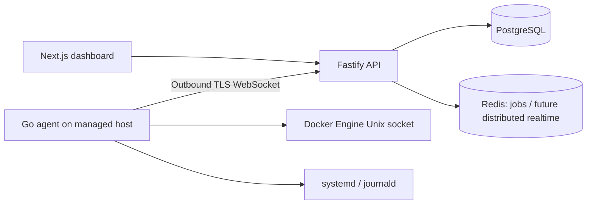

# CloudDeck

CloudDeck is a multi-server operations and observability platform that combines monitoring, Docker operations, Linux service control, logs, deployments, uptime, backups, alerts and secure remote access in one workspace. The repository is being built phase-by-phase with production safety constraints rather than placeholder buttons.


## Implemented

- Next.js responsive dashboard with demo servers, authentication flows, workspace inventory, server onboarding, server detail metrics, and Docker controls.
- Fastify API with PostgreSQL migrations, Argon2id passwords, short-lived JWTs, rotating/revocable refresh cookies, personal/team workspaces, RBAC, audit logs, session management, verification and reset flows.
- Go Linux agent with outbound authenticated WebSocket, one-time pairing, heartbeat telemetry, CPU/RAM/disk/load/network metrics, reconnect and protected credential storage.
- Metric aggregation into one-minute PostgreSQL buckets instead of persisting every realtime event.
- Docker container inventory and audited restart through typed agent commands.
- systemd service inventory plus audited start/stop/restart actions. Unit names are strictly validated and no shell command endpoint exists.
- Bounded systemd journal snapshots plus realtime Docker/systemd log subscriptions using one-time WebSocket tickets, cancellation, and capped in-memory UI buffers.
- Docker Compose local stack and GitHub Actions checks for Node and Go.
- Deployment lifecycle state machine with guarded transitions, event history, lifecycle timestamps, RBAC-protected read APIs, and rollback-state support.

## Architecture



CloudDeck does not expose an unrestricted remote command API. Every non-terminal agent action must be explicitly typed, validated, authorized and auditable.

## Local development

Requires Node 22, npm 11, PostgreSQL 17, and Go 1.23.

```bash
cp .env.example .env
npm ci
npm run migrate
npm run dev
npm run dev:web
```

Before opening a PR run:

```bash
npm run lint
npm run typecheck
npm test
npm run build
cd services/agent && go test ./... && go build ./...
```

## Pair an agent

Create a server in the dashboard and use its server ID and one-time pairing token:

```bash
cd services/agent
go build -o clouddeck-agent .
read -rs CLOUDDECK_PAIRING_TOKEN
sudo env CLOUDDECK_API_URL=https://api.example.com CLOUDDECK_SERVER_ID=<server-uuid> CLOUDDECK_PAIRING_TOKEN="$CLOUDDECK_PAIRING_TOKEN" CLOUDDECK_AGENT_BIN="$PWD/clouddeck-agent" ./install.sh
unset CLOUDDECK_PAIRING_TOKEN
```

The installer pairs once, saves the long-lived credential in a 0600 file and starts a dedicated systemd service. Docker access is opt-in via `CLOUDDECK_DOCKER_SOCKET=/var/run/docker.sock`; Docker group membership is effectively root-equivalent. systemd service control also requires the local CloudDeck service account to have only the specific sudo/polkit permissions needed in the deployment. Do not grant unrestricted passwordless sudo.

See [agent protocol](docs/AGENT_PROTOCOL.md), [security](docs/SECURITY.md), [architecture](docs/ARCHITECTURE.md), and [deployment](docs/DEPLOYMENT.md).

## Roadmap

1. Foundation: auth, organizations, database, dashboard — functional baseline.
2. Agent: pairing, heartbeat, telemetry, metric aggregation — functional baseline; distributed connection routing still pending.
3. Operations: Docker lifecycle/inspection, Compose service controls, systemd management, bounded snapshots, and realtime Docker/systemd logs — functional baseline.
4. Browser terminal — dedicated permission, one-time tickets, PTY lifecycle, audit records, resize/input channels, a 30-minute limit, and xterm.js server-detail UI with automatic fitting/resize.
5. Deployments — guarded state machine/read APIs implemented; next: GitHub App source connection, BullMQ execution, health activation, and rollback orchestration.
6. Health checks, alert rules and email/in-app notifications.
7. Caddy/Nginx domains, encrypted secrets, verified backups and restore.
8. Flutter monitoring and emergency-operation mobile app.

No UI or API response claims a pending feature was performed.
