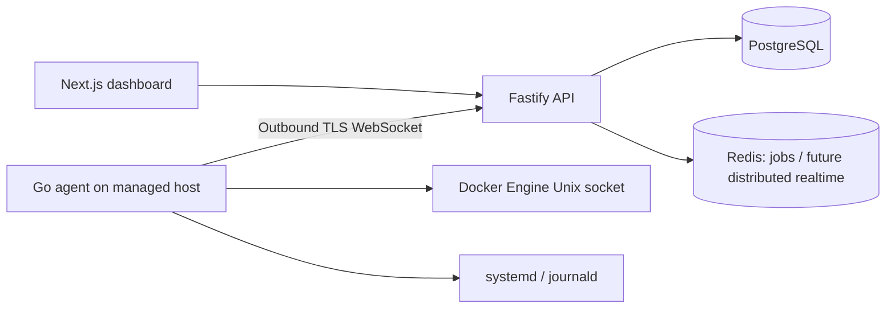

# CloudDeck

CloudDeck is a multi-server operations and observability platform that combines monitoring, Docker operations, Linux service control, logs, deployments, uptime, backups, alerts and secure remote access in one workspace. The repository is being built phase-by-phase with production safety constraints rather than placeholder buttons.


## Implemented

- Next.js responsive dashboard with demo servers, authentication flows, workspace inventory, server onboarding, server detail metrics, and Docker controls.
- Fastify API with PostgreSQL migrations, Argon2id passwords, short-lived JWTs, rotating/revocable refresh sessions, optional TOTP two-factor authentication with one-time recovery codes, personal/team workspaces, RBAC, audit logs, verification and reset flows.
- Go Linux agent with outbound authenticated WebSocket, one-time pairing, heartbeat telemetry, CPU/RAM/disk/load/network metrics, reconnect and protected credential storage.
- Metric aggregation into one-minute PostgreSQL buckets plus durable hourly rollups for 7/30-day history, configurable raw/hourly retention, and bounded long-range API responses.
- Docker container inventory and audited restart through typed agent commands.
- systemd service inventory plus audited start/stop/restart actions. Unit names are strictly validated and no shell command endpoint exists.
- Bounded systemd journal snapshots plus realtime Docker/systemd log subscriptions using one-time WebSocket tickets, cancellation, and capped in-memory UI buffers.
- Docker Compose local stack and GitHub Actions checks for Node and Go.
- Deployment lifecycle state machine with guarded transitions, event history, lifecycle timestamps, RBAC-protected read APIs, and rollback-state support.
- Domain inventory, distributed TLS certificate monitoring with expiry alerts and SSRF-safe public probing, plus optional least-privilege Caddy/Nginx proxy automation through a separate root helper.
- Encrypted workspace secret storage using AES-256-GCM, metadata/value separation, no plaintext read API, audited rotation/deletion, and admin/owner management.
- Verified backups for allowlisted directories, local Docker volumes, PostgreSQL, and MySQL, with local or S3-compatible targets, typed Agent execution, SHA-256 manifests, archive re-read verification, signed S3 post-upload verification, retention cleanup, recurring schedules, encrypted credentials, and confirmed audited PostgreSQL/MySQL/directory/Docker-volume restore workflows.
- Flutter mobile foundation with native rotating refresh-token sessions, device secure storage, dashboard/server monitoring, historical metrics, alerts, deployment status, notifications, Docker container inventory, bounded logs, and confirmed container restart for authorized operators.

## Architecture



CloudDeck does not expose an unrestricted remote command API. Every non-terminal agent action must be explicitly typed, validated, authorized and auditable.

## Local development

Requires Node 22, npm 11, PostgreSQL 17, and Go 1.23.

```bash
cp .env.example .env
npm ci
npm run migrate
npm run dev
npm run dev:web
```

Generate a local development master key once with `openssl rand -base64 32` and place it in `CLOUDDECK_MASTER_KEY`. Production deployments should inject it through the platform secret manager rather than committing it.

Before opening a PR run:

```bash
npm run lint
npm run typecheck
npm test
npm run build
cd services/agent && go test ./... && go build ./...
```

## Pair an agent

Create a server in the dashboard and use its server ID and one-time pairing token:

```bash
cd services/agent
go build -o clouddeck-agent .
read -rs CLOUDDECK_PAIRING_TOKEN
sudo env CLOUDDECK_API_URL=https://api.example.com CLOUDDECK_SERVER_ID=<server-uuid> CLOUDDECK_PAIRING_TOKEN="$CLOUDDECK_PAIRING_TOKEN" CLOUDDECK_AGENT_BIN="$PWD/clouddeck-agent" ./install.sh
unset CLOUDDECK_PAIRING_TOKEN
```

The installer pairs once, saves the long-lived credential in a 0600 file and starts a dedicated systemd service. Docker access is opt-in via `CLOUDDECK_DOCKER_SOCKET=/var/run/docker.sock`; Docker group membership is effectively root-equivalent. systemd service control also requires the local CloudDeck service account to have only the specific sudo/polkit permissions needed in the deployment. Do not grant unrestricted passwordless sudo.

### Optional proxy helper

Managed Caddy/Nginx configuration is intentionally separate from the unprivileged Agent. Build and install the helper only on servers where CloudDeck should manage reverse-proxy fragments:

```bash
cd services/agent
go build -o clouddeck-proxy-helper ./proxyhelper
sudo env CLOUDDECK_PROXY_HELPER_BIN="$PWD/clouddeck-proxy-helper" ./install-proxy-helper.sh
```

For Caddy, add this import once to the server's main `/etc/caddy/Caddyfile`:

```caddy
import /etc/caddy/clouddeck.d/*
```

The helper refuses Caddy changes unless that import exists. Nginx apply verifies the generated `conf.d` file is present in `nginx -T` before reload.

See [agent protocol](docs/AGENT_PROTOCOL.md), [security](docs/SECURITY.md), [architecture](docs/ARCHITECTURE.md), and [deployment](docs/DEPLOYMENT.md).

## Roadmap

1. Foundation: auth, organizations, database, dashboard — functional baseline.
2. Agent: pairing, heartbeat, telemetry, one-minute aggregation, hourly downsampling/retention — functional baseline; distributed connection routing still pending.
3. Operations: Docker lifecycle/inspection, Compose service controls, systemd management, bounded snapshots, and realtime Docker/systemd logs — functional baseline.
4. Browser terminal — dedicated permission, one-time tickets, PTY lifecycle, audit records, resize/input channels, a 30-minute limit, and xterm.js server-detail UI with automatic fitting/resize.
5. Deployments — guarded state machine/read APIs, verified GitHub App linking, installation-scoped repository/branch discovery, and validated Application source configuration implemented; next: BullMQ execution, health activation, and rollback orchestration.
6. Health checks, alert rules and email/in-app notifications.
7. Domains/TLS monitoring, constrained Caddy/Nginx proxy automation, encrypted secrets, verified local/S3-compatible backups, recurring scheduling, and all supported restore workflows are functional; encrypted backup payloads remain.
8. Flutter monitoring and emergency-operation mobile app — foundation and core monitoring/emergency surfaces implemented; Android/iOS platform packaging, push notifications, and release artifacts remain.

No UI or API response claims a pending feature was performed.
