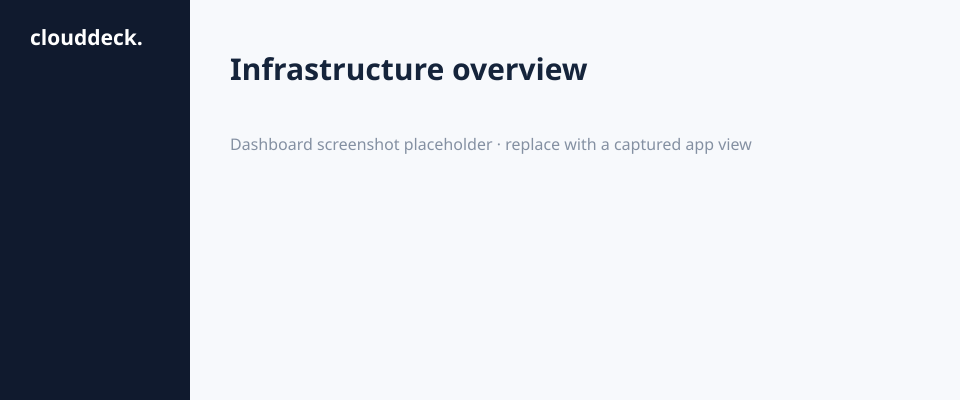
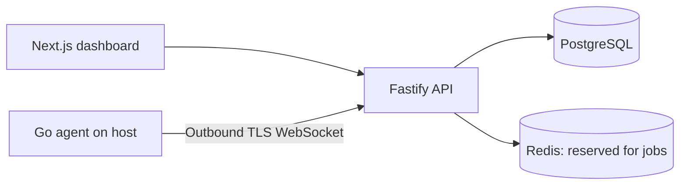

# CloudDeck

CloudDeck brings server inventory, operational status, and agent metrics into one workspace. This repository is an **early functional foundation**. It is not yet suitable for managing production hosts: remote actions, alerts, notifications, backups, deployment, terminal, and mobile are tracked in the roadmap below.



## Implemented

- Next.js responsive dashboard with a clearly labeled four-server demo preview, sign in, registration, real workspace listing, server creation, server metrics detail, and pairing token display.
- Fastify API with PostgreSQL migrations, Argon2id passwords, short-lived JWTs, rotating/revocable refresh cookie, personal and team workspaces, role authorization, audit records, session listing/revocation, and email verification/password reset through SMTP.
- Go Linux agent with outbound authenticated WebSocket, one-time 10-minute pairing, heartbeat samples, CPU/RAM/disk/load/network telemetry, reconnect, and 0600 credential file. API aggregates metric samples into minute buckets.
- Docker Compose for web, API, PostgreSQL, Redis and GitHub Actions checks for Node and Go.

## Architecture



The Redis service is provisioned but not used yet. No arbitrary command execution endpoint exists. Future operations must be implemented as individually authorized and audited typed actions.

## Local development

Requires Node 22, npm 11, PostgreSQL 17, and Go 1.23 for the agent. Copy `.env.example` to `.env`, set a random 32+ byte `JWT_SECRET`, and provision the matching PostgreSQL database. Export the environment from `.env` into the process before using the commands below.

```bash
npm ci
npm run migrate
npm run dev
npm run dev:web
```

Open `http://localhost:3000` for the demo. Register to create a personal workspace. API runs on `localhost:4000`. Run `npm run typecheck`, `npm test`, and `npm run build` before changes.

## Pair an agent

Create a server in the signed-in dashboard and copy the server ID and pairing token from the API response. The dashboard displays both values once. Build the agent with `cd services/agent && go build -o clouddeck-agent .`. Configure `CLOUDDECK_API_URL`, `CLOUDDECK_SERVER_ID`, `CLOUDDECK_PAIRING_TOKEN`, and `CLOUDDECK_CREDENTIAL_FILE` on first run. Subsequent runs only need API URL, server ID, and the credential file. See [agent protocol](docs/AGENT_PROTOCOL.md). Use a TLS reverse proxy outside local development.

## Production deployment

See [deployment guide](docs/DEPLOYMENT.md). The Compose stack includes Mailpit for local email testing at `http://localhost:8025`. Configure a real SMTP provider and sender identity for production.

## Roadmap

1. **Foundation (partial):** auth, organizations, database, dashboard. Pending: TOTP, member management, fuller integration tests.
2. **Agent (partial):** pairing, outbound telemetry, minute buckets. Pending: hardening, system service packaging, distributed heartbeat sweep, realtime fan-out.
3. Docker/systemd inventory, typed audited actions, streaming logs.
4. Browser terminal with dedicated permission and session limits.
5. GitHub App, deployment pipeline and rollback.
6. Health checks, alert rules and email/in-app notifications.
7. Caddy/Nginx domains, encrypted secrets, verified backups and restore.
8. Flutter monitoring and emergency actions.

No UI button claims that a pending operation was performed. See [architecture](docs/ARCHITECTURE.md) and [security](docs/SECURITY.md).
